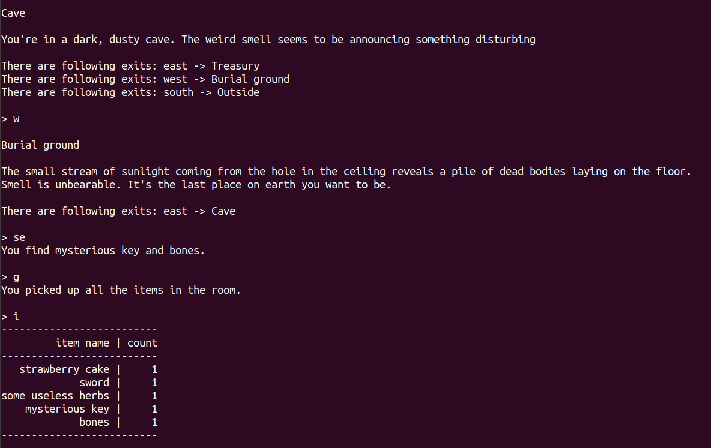
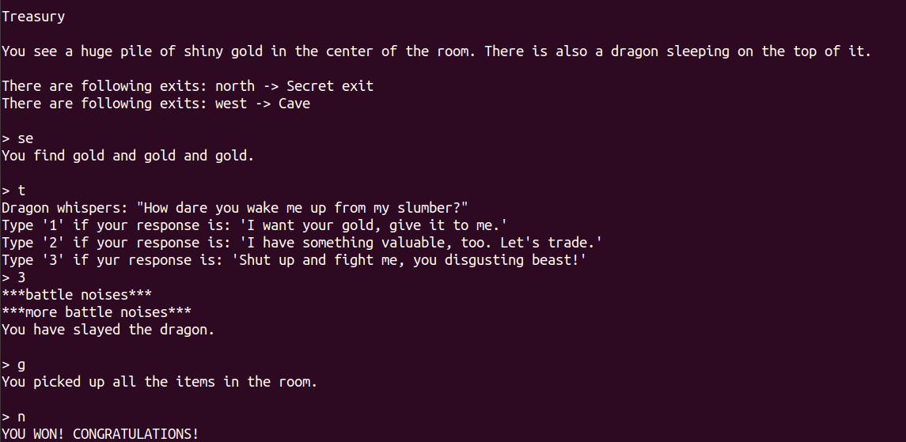

# Python exercise 4 - Dungeons and Dragons simplified game
The project performed as a pair assignment during workshops in Codecool. The aim of the workshop was to find compromise between "done" and "perfect", therefore the total time for the assignment was 5 hours.

## General info
The features that we managed to complete were:
* user's movement - user was able to walk between rooms using "n", "s", "e", and "w" commands
* while changing room, the description and possible directions were printed
* searching for items and picking them - items are added to user's inventory and might be used afterwards
* displaying items in a form of table
* displaying help with all possible commands
* adding bigger game scenario, with user's interactions with npc and found items (e.g. talking to the dragon or opening the door only with a key)
* possibility to win or loose the game

## Screenshots

## Technologies
* Python 3.6

## Lessons learned from the assignment
* Working with dictionaries as an introduction to objective programming in the future
* Working with main() function as a game's engine
* Planning game's logic to be as effective as possible

## Status
Project is finished.

## Credits
Project assigned and supervised by Codecool mentors.
